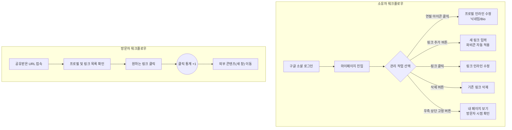

# 마이링크 (MyLink) 사용자 시나리오

## 1. 방문자(Visitor) 시나리오

- **페이지 접속:** 방문자는 소유자의 프로필과 링크 모음을 확인하기 위해 `도메인.com/displayName` 형태의 마이링크 URL에 접속한다.
- **프로필 확인:** 방문자는 소유자의 실제 유저 네임(닉네임)과 한 줄 소개(Bio)를 읽고 소유자가 누구인지 파악하기 위해 프로필 영역을 확인한다.
- **링크 탐색:** 방문자는 소유자가 공유한 다양한 외부 콘텐츠(블로그, 포트폴리오, SNS 등)의 제목과 파비콘 아이콘을 확인하기 위해 링크 리스트를 둘러본다.
- **링크 클릭 및 통계 집계:** 방문자는 관심 있는 특정 콘텐츠로 이동하기 위해 링크 아이템을 클릭한다. (이때 시스템은 내부적으로 해당 링크의 클릭 통계를 1 증가시킨 뒤 외부 페이지로 리다이렉트한다.)

## 2. 소유자(Owner) 시나리오

- **가입 및 로그인:** 소유자는 마이링크 서비스를 이용하기 위해 구글 소셜 로그인 버튼을 클릭하여 간편하게 로그인(및 회원가입)한다.
- **마이페이지 진입:** 소유자는 자신의 링크와 프로필을 관리하기 위해 로그인 직후 관리자 화면인 '마이페이지'로 진입한다.
- **프로필 정보 수정 (인라인 편집):** 소유자는 방문자에게 보여질 자신의 닉네임과 한 줄 소개를 수정하기 위해, 항목 옆에 직관적으로 표시된 **연필 아이콘(✏️)**을 클릭하여 화면 이동 없이 즉시 텍스트를 수정(인라인 편집)한다.
- **링크 추가:** 소유자는 새로운 외부 콘텐츠를 공유하기 위해 '링크 추가' 버튼을 클릭하고 추가할 웹사이트의 URL과 제목을 입력한다.
- **파비콘 확인:** 소유자는 새로 추가한 링크의 URL을 기반으로 구글 파비콘 API가 작동하여 아이콘이 자동으로 적용되는 것을 확인하기 위해 링크 리스트를 확인한다.
- **링크 수정 (인라인 편집):** 소유자는 오타를 수정하거나 URL을 변경하기 위해 등록된 링크 항목을 클릭하여 화면 이동 없이 즉시 텍스트를 수정(인라인 편집)한다.
- **링크 삭제:** 소유자는 더 이상 공유를 원치 않는 링크를 목록에서 제거하기 위해 해당 항목의 '삭제' 버튼을 클릭한다.
- **퍼블릭 페이지 확인:** 소유자는 자신이 세팅한 페이지가 방문자에게 어떻게 보여지는지 확인하기 위해, 화면 우측 상단에 고정된 **'내 페이지 보기'** 버튼을 클릭한다.

---

## 3. 사용자 워크플로우 (Mermaid)

